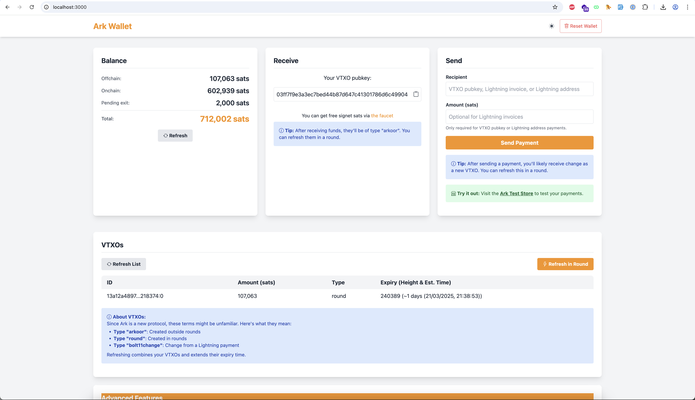

# Ark Wallet Interface

A simple web interface for interacting with the Ark Protocol on Bitcoin Signet via the bark CLI.

## Demo



*A screenshot of the Ark Wallet Interface in action*

For a video demonstration of the interface, see the included [demo.mp4](demo.mp4) file.

## What is this?

This project provides a web interface that simplifies interaction with the `bark` command-line tool. It is **not** a complete wallet implementation itself, but rather a frontend that makes the functionality of the Ark CLI more accessible.

## Prerequisites

- Node.js (v14 or higher)
- The `bark` command-line tool (must be installed separately)

## Installation

### Step 1: Set up the web interface

```bash
git clone https://github.com/ShadowySuperStacker/ark-web-wallet.git
cd ark-web-wallet
npm install
```

### Step 2: Install bark CLI (if not already installed)

This web interface requires the `bark` CLI tool to function. You can obtain it from the official repository:

#### On macOS (Apple Silicon):
```bash
curl https://codeberg.org/ark-bitcoin/bark/releases/download/all-0.0.0-alpha.9/bark-0.0.0-alpha.9-apple-aarch64 --output bark
chmod +x bark
```

#### On macOS (Intel):
```bash
curl https://codeberg.org/ark-bitcoin/bark/releases/download/all-0.0.0-alpha.9/bark-0.0.0-alpha.9-apple-x86_64 --output bark
chmod +x bark
```

#### On Linux (x86_64):
```bash
curl https://codeberg.org/ark-bitcoin/bark/releases/download/all-0.0.0-alpha.9/bark-0.0.0-alpha.9-linux-x86_64 --output bark
chmod +x bark
```

#### On Windows:
```bash
wget https://codeberg.org/ark-bitcoin/bark/releases/download/all-0.0.0-alpha.9/bark-0.0.0-alpha.9-windows-x86_64.exe -OutFile bark.exe
```

Place the `bark` executable in the root directory of this project, or ensure it's in your system PATH.

## Running the Interface

Start the web server:

```bash
node index.js
```

The server will try to use port 3000 by default. If port 3000 is already in use, it will automatically try ports 3001, 3002, and 3003.

Open your browser and navigate to the URL shown in the console (typically http://localhost:3000).

## Features

This interface provides a simplified way to:

- View your Ark wallet balance
- Receive funds via your VTXO pubkey
- Manage and view your VTXOs
- Refresh VTXOs in rounds
- Send payments to various destinations:
  - Other Ark users (via VTXO pubkey)
  - Lightning invoices (e.g., from the [Ark Test Store](https://signet.2nd.dev/store))
  - Bitcoin addresses (on-chain)
- Reset your Ark wallet if needed

All operations are performed by executing the corresponding `bark` commands in the background.

## Testing with Signet

1. **First-time setup**: When you first run the server, it will check if a bark wallet exists. If not, it will automatically create one configured for signet.

2. **Get test coins**: 
   - Copy your VTXO pubkey from the "Receive" section
   - Visit the [Signet Faucet](https://signet.2nd.dev/) to get test sats

3. **Experiment**: 
   - Try refreshing VTXOs
   - Send funds to other VTXO pubkeys
   - Test Lightning payments through the Ark protocol

4. **Test payments in the store**:
   - Visit the [Ark Test Store](https://signet.2nd.dev/store)
   - Order a treat for "Byte" (the Second mascot)
   - Pay using the Ark protocol
   - This is a great way to test the full payment flow in a real-world scenario

## Ark Protocol Facts

- **VTXO**: Virtual Transaction Output - the basic unit in Ark, similar to UTXOs in Bitcoin
- **Expiry Height**: Each VTXO has an expiration block height, after which it can no longer be used
- **Rounds**: Collaborative processes between users to refresh VTXOs
- **VTXO Types**: 
  - **arkoor**: Created outside rounds
  - **round**: Created in rounds
  - **bolt11change**: Change from a Lightning payment

## Resources

- [Official Ark Documentation](https://docs.second.tech/getting-started/)
- [Signet Faucet](https://signet.2nd.dev/) - Get free test sats
- [Ark Test Store](https://signet.2nd.dev/store) - Test your Ark payments by buying treats for Byte

## Summary

This web interface is a tool for developers to more easily interact with the Ark protocol on Signet through the bark CLI. It simplifies testing and experimentation with the Ark Layer 2 technology by providing a graphical alternative to command-line operations. 